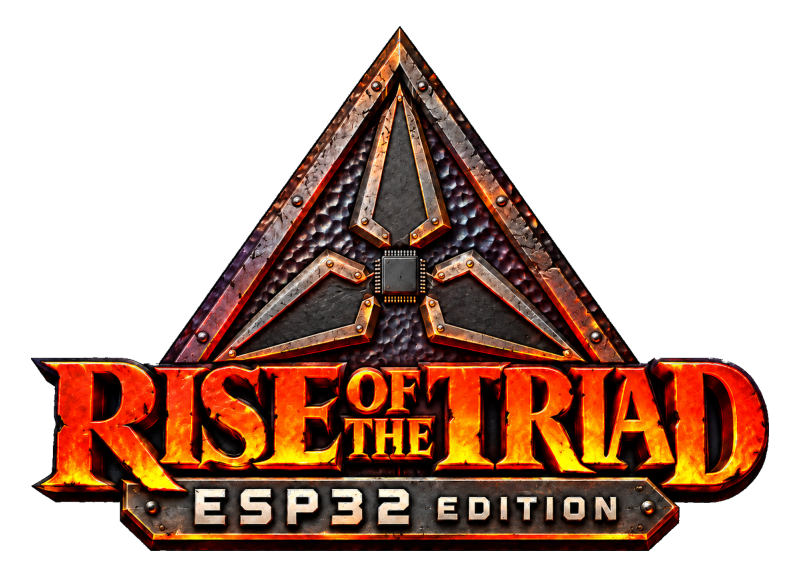
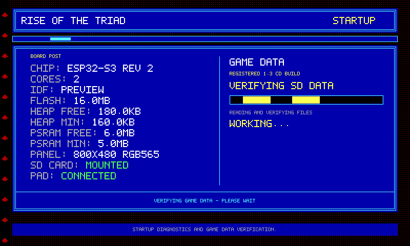
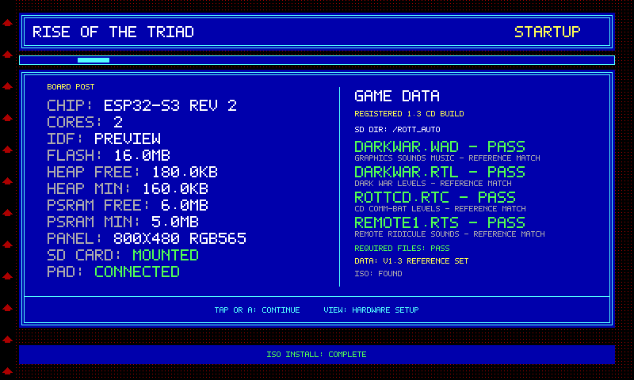
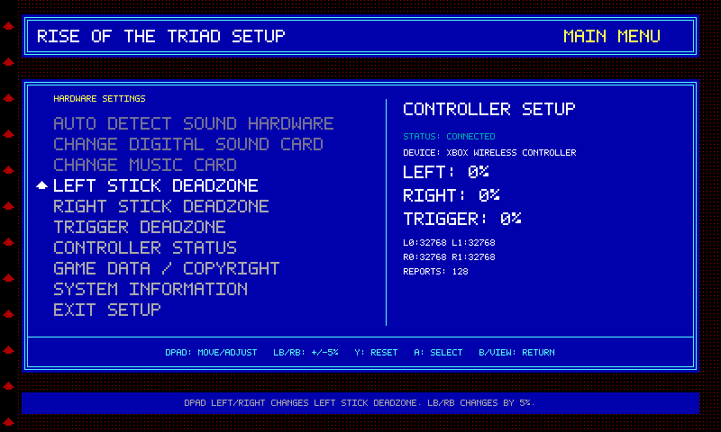

# rott_esp32

**Rise of the Triad - ESP32 Edition.**

<p align="center">
  
</p>

**rott_esp32** is an experimental native port of the original **Rise of the Triad** engine to the **ESP32-S3**. The aim is to bring its fast movement, oversized weapons, and ludicrous gibs to a handheld-sized embedded platform, running compiled engine code directly on the microcontroller.

The reference target is an **Elecrow CrowPanel 7-inch HMI V3.0**, with an **ESP32-S3-WROOM-1-N4R8**, an **800×480 RGB display**, **8 MB PSRAM**, and **4 MB flash**.

This project starts with a substantial advantage: **ESP4GW and the CrowPanel hardware work developed alongside dESPcent already exist.** Display bring-up, SD storage, BLE controller support, startup sequencing, and memory-management lessons can carry forward into another DOS engine port.

ROTT is the next test of that approach. Reusing those foundations has already accelerated the work; completing ROTT will extend the set of DOS and Watcom services that future ports can share.

## Current Status

**Early engine porting, with a substantial board and application foundation in place. Working ROTT gameplay is not yet established.**

*Status snapshot: October 4, 2026. Experimental development tree.*

dESPcent has reached working gameplay and completed campaign runs. Those are dESPcent milestones. ROTT is much earlier in its engine integration, even though it inherits the same hardware experience and reusable platform work.

| Area | Current state |
| --- | --- |
| CrowPanel foundation | Board, RGB display, SD, and BLE controller code carried over from dESPcent. |
| Startup application | Board initialization, display reservation, BLE startup, POST, data checks, and an engine-task handoff are implemented. |
| Hardware setup | ROTT-style setup pages and controller-deadzone settings are implemented; device checks remain. |
| Game-data preparation | Build-specific file discovery, reference hashes, structure checks, and an ISO extraction path are implemented. |
| Setup/POST previews | Host-rendered previews and UI checks are available. Their hardware values are simulated. |
| Firmware build evidence | The setup documentation records an ESP-IDF v6.0.1 build using a **stub `rott_main`**. This does not establish a working engine build. |
| ROTT engine | Original sources are registered in CMake; compiler compatibility, runtime services, and hardware-dependent code are still being adapted. |
| Menus and gameplay | Original in-engine menus, rendered levels, playable controls, and sustained gameplay remain milestones to establish. |
| Sound and multiplayer | ROTT playback and networking are not established. |

### Current Tasks

- Complete the Watcom compatibility surface and resolve the engine's remaining compile/link issues.
- Implement the DOS runtime services ROTT actually uses, including paths, interrupt vectors, timing, and memory queries.
- Replace direct low-memory access and x86 assembly with native equivalents.
- Connect ROTT's Mode X drawing and palette behavior to the RGB display backend.
- Reach original engine startup and menus, then a rendered level and controllable gameplay.
- Verify each step on the CrowPanel before marking it as working.

## Screens & Menus

The startup application adopts ROTT's DOS setup appearance: blue panels, cyan borders, yellow headings, and a red patterned background. POST and hardware setup share drawing code so their appearance and behavior stay consistent.

**The images below are host-generated previews of the actual UI drawing code. They are not device photographs or evidence of ROTT gameplay. Hardware readings and file results shown in them are fixtures.**

### Startup and data checks

<p align="center">
  
</p>

<p align="center"><em>POST combines board information with progress through the ROTT data checks.</em></p>

<p align="center">
  
</p>

<p align="center"><em>The ready state presents file results and the controls for continuing or opening hardware setup.</em></p>

### Hardware setup

<p align="center">
  
</p>

<p align="center"><em>The board setup interface belongs to the ESP32 application; it is separate from ROTT's original in-game menus.</em></p>

See [the setup documentation](doc/rott-setup-screen.md) for integration details, remaining device checks, and preview generation.

## Goals

### Keep ROTT recognizable

Retain the original game logic, software rendering behavior, fixed-point calculations, resource formats, and menu flow wherever practical. The source baseline is the original **v1.3 CD source release**, not a new recreation of the game.

### Make platform work reusable

Translate the services the engine expects into services ESP32 hardware can provide. Put reusable DOS/Watcom behavior into ESP4GW and keep CrowPanel-specific wiring in the board layer. Reserve engine patches for assumptions that cannot be redirected at that boundary.

### Establish correctness, then measure

First reach a correct frame and reliable input. Then measure frame time, memory use, storage access, and scheduling under real game load. There is no ROTT frame-rate or campaign-completion claim yet.

## ESP4GW: The Head Start

The largest early gain is avoiding a fresh hardware bring-up for every game. dESPcent established the practical foundation; ROTT demonstrates that the platform work can be reused across engines.

ESP4GW is the compatibility-layer approach behind that reuse: compile legacy source for the ESP32 and provide the DOS/compiler services it expects. **It is not an x86 emulator, and this project does not run the original `ROTT.EXE`.**

The current tree keeps the main responsibilities separate:

| Location | Responsibility |
| --- | --- |
| [`source/rott`](source/rott) | Original engine and ROTT-specific adaptations. |
| [`source/platform`](source/platform) | DOS/Watcom compatibility work, including file services and compiler definitions. |
| [`source/hardware`](source/hardware) | CrowPanel board, display, and BLE controller support. |
| [`source/app`](source/app) | Boot orchestration, POST, hardware setup, data checks, and installation. |

The board layer is deliberately game-independent. The compatibility implementation in this tree is still evolving; it is not yet a complete DOS runtime or a finished shared board package.

ROTT exercises contracts beyond those already needed by dESPcent: Watcom register layouts, interrupt chaining, PIT-driven timers, keyboard-controller behavior, DPMI memory queries, and VGA/Mode X operations. Each reusable service completed here can reduce the work required by another DOS source port.

That is the proof so far: **the reuse works and the head start is real.** It does not make arbitrary DOS programs run unchanged. Raw accesses to PC memory addresses and x86 assembly still require deliberate porting.

The [Watcom profile analysis](doc/esp4gw-watcom-profile-rott.md) records ROTT's requirements and proposed implementations. It is a dated engineering snapshot, not a checklist of completed runtime features.

## Target Hardware

| Component | Reference configuration |
| --- | --- |
| Board | Elecrow CrowPanel 7-inch HMI, V3.0 |
| MCU | ESP32-S3-WROOM-1-N4R8, dual-core, configured at 240 MHz |
| Memory | Internal SRAM plus 8 MB octal PSRAM at 80 MHz |
| Flash | 4 MB; custom single-factory-app partition layout |
| Display | 800×480 RGB panel with RGB565 framebuffers |
| Storage | FAT-formatted SD card over SPI, mounted at `/sdcard` |
| Touch | GT911 capacitive touch; V3.0 board sequencing through PCA9557 |
| Controller | BLE Xbox Wireless Controller path targeting model 1914 |

This is currently a board-specific port. A device with an ESP32-S3 alone is not an equivalent target: display wiring, PSRAM capacity, peripherals, and board initialization matter.

## Memory and Display Strategy

The hardware layer already provides RGB scanout and PSRAM framebuffer management. ROTT's original VGA/Mode X behavior still needs to be connected to it.

The startup application reserves display buffers before BLE initialization to reduce memory-fragmentation risk. It starts scanout after BLE/NVS initialization, runs POST, and then requests a switch to one panel framebuffer before entering the engine task.

| Allocation | Current design |
| --- | ---: |
| Two 800×480 RGB565 POST framebuffers | 1,536,000 bytes |
| One 800×480 RGB565 framebuffer after POST | 768,000 bytes |
| Engine task stack allocated in PSRAM | 131,072 bytes |

The application also sets allocations above 512 bytes to prefer PSRAM after POST. This is a starting policy inherited from the hardware work, not a measured optimum for ROTT.

Engine memory, cached resources, Bluetooth, display buffers, and task stacks must coexist. ROTT's zone sizing and original low-memory assumptions need their own validation. The final game presentation path, scaling, and performance are still being established; dESPcent's working display behavior does not by itself validate ROTT's renderer.

## Controls

The startup application has a BLE Xbox controller path and touch handling. Its intended POST controls are:

- **Tap / A / Start:** continue after the data check succeeds.
- **View:** open hardware setup.
- **B / View:** exit hardware setup.

Controller deadzone settings have an NVS-backed implementation. Reconnection, persistence, and the POST-to-engine display handoff still need device verification in this port.

**ROTT gameplay bindings are not finalized or validated.** Movement, aiming, firing, weapon changes, and original menu navigation must be connected to ROTT's own input contracts. Hardware setup is currently integrated at POST; opening it during gameplay is not wired.

## Audio

The CrowPanel hardware work supplies the board-side foundation and I²S pin definitions. **ROTT sound effects and music are not yet established on this port.**

ROTT's original audio library expects DOS-era timing and sound devices. Timer services, sample playback, mixing, and output integration must be completed and verified. Music will additionally need an appropriate sequence/synthesis or playback backend.

Working audio in dESPcent is useful experience, but it is not evidence that ROTT's audio path is ready.

## Game Data

Supply game data from your own compatible copy of Rise of the Triad. The engine's source license does not grant redistribution rights to the commercial game assets.

The current `DEVELOP.H` selects **registered v1.3 CD / `SUPERROTT`** data. Place this complete set together on the SD card:

```text
SD card/
└── ROTT/
    ├── DARKWAR.WAD
    ├── DARKWAR.RTL
    ├── ROTTCD.RTC
    └── REMOTE1.RTS
```

The data scanner prefers a complete set in the SD root, then `/ROTT`, then `/ROTT_AUTO`. It does not assemble a set from files scattered across those directories.

Other compile-time editions select different filenames:

| Build selection | Required files |
| --- | --- |
| Registered CD, current selection | `DARKWAR.WAD`, `DARKWAR.RTL`, `ROTTCD.RTC`, `REMOTE1.RTS` |
| Registered | `DARKWAR.WAD`, `DARKWAR.RTL`, `DARKWAR.RTC`, `REMOTE1.RTS` |
| Site license | `DARKWAR.WAD`, `DARKWAR.RTL`, `ROTTSITE.RTC`, `REMOTE1.RTS` |
| Shareware | `HUNTBGIN.WAD`, `HUNTBGIN.RTL`, `HUNTBGIN.RTC`, `REMOTE1.RTS` |

These are implemented data selections, not claims that every edition is playable. [`data_files.h`](source/app/data_files.h) defines the required sets and known reference hashes.

POST distinguishes readable, nonempty files from reference-hash and structure results. A file showing `PASS` is not proof that an entire release can be played. DOS executables such as `ROTT.EXE` and `SETUP.EXE` are not used by the native port.

### Optional ISO installation

An ISO9660 extraction path is implemented for a supported CD image placed in the SD root or `/ROTT`. When no complete loose-file set is available, it looks for the build's required files together in the image, stages them in `/.rott-install`, verifies the copied bytes, and promotes the result to `/ROTT_AUTO`.

The reader handles 2048-byte-sector ISO images with contiguous, non-interleaved files. Raw BIN/CUE images and compressed installer archives are outside that path. The original ISO and existing loose data are left intact; runtime uses the extracted files.

## Known Incomplete Areas

- A complete native engine build and verified execution through startup.
- Interrupt-vector dispatch, interrupt chaining, and timer/keyboard services required by the legacy code.
- DOS path handling for ordinary `open()`/`fopen()` calls; setting the compatibility layer's default directory does not yet cover every file access.
- DPMI memory reporting and correct engine zone allocation.
- Replacements for x86 assembly, direct PC-memory accesses, and VGA/Mode X hardware operations.
- Original menu rendering, level rendering, gameplay controls, save/load behavior, and demo playback.
- ROTT sound effects, music, and multiplayer.
- Scheduler-friendly handling of DOS polling loops and sustained performance measurements.
- Device verification of setup behavior, saved deadzones, and display ownership during handoff.

## Development

This is an **ESP-IDF CMake project** targeting `esp32s3`. The setup documentation records checks with **ESP-IDF v6.0.1**. The root `sdkconfig`, `sdkconfig.defaults`, and `partitions.csv` describe the board configuration; the partition table has one factory application and no OTA slots.

### Build configuration

**The checked-in root `sdkconfig` currently disables Bluetooth, while `sdkconfig.defaults` enables it.** Defaults do not override existing settings. Enable the required BLE/Bluedroid configuration before attempting the controller-enabled application build, or create a separate configuration from the defaults.

From an initialized ESP-IDF environment, a separate development configuration can be prepared with:

```sh
idf.py -B build/rott-dev -D SDKCONFIG=build/rott-dev/sdkconfig set-target esp32s3
idf.py -B build/rott-dev -D SDKCONFIG=build/rott-dev/sdkconfig menuconfig
idf.py -B build/rott-dev -D SDKCONFIG=build/rott-dev/sdkconfig build
```

These are development build steps, not a promise that the unfinished engine currently compiles or produces playable firmware. The recorded stub-entry build validates a narrower application/UI integration milestone.

### UI previews

```sh
python tools/preview_setup.py
```

The preview harness compiles the real setup drawing code against simulated hardware and writes images to `images/setup-preview`. It checks menu interactions, framebuffer guards, and matching strip/full-frame rendering. It does not validate Bluetooth, NVS persistence, I²C, RGB timing, or engine execution on an ESP32.

See [`doc`](doc) for porting notes. Read each note in its dated context; an analysis or proposed service is not necessarily an implemented feature.

## Development Philosophy

Preserve the engine's expectations where possible, and make every necessary platform change explicit. Unsupported hardware services should fail visibly rather than report success and leave the engine running with invalid assumptions.

ROTT-specific rendering and game behavior belong in the port. Reusable DOS services belong in ESP4GW. CrowPanel wiring belongs in the hardware layer. Keeping those boundaries clear is what makes the next engine cheaper to bring up.

## Source and Licensing

**rott_esp32 uses the GNU General Public License, version 3 (GPL-3.0).** The original Apogee ROTT v1.3 source was released under GPL version 2 or later; this port uses the permitted GPLv3 option. Original copyright and license notices remain applicable, and third-party components retain their own notices and terms.

Distributions must satisfy the applicable GPL source and notice requirements, including providing corresponding source for distributed firmware. The full license is available from the [GNU Project](https://www.gnu.org/licenses/gpl-3.0.html).

The project license covers software within its scope. It does not make the original game's WADs, maps, sounds, music, artwork, or other commercial data freely redistributable. Provide those separately from a copy you are entitled to use.

Rise of the Triad and associated names and marks belong to their respective owners. rott_esp32 is an independent port and is not affiliated with or endorsed by those owners.

## Why?

Because Rise of the Triad on a tiny chip is worth attempting. The work already invested in ESP4GW and the CrowPanel means this attempt starts much further ahead.

The next milestones are concrete: finish the runtime contracts, enter the original engine, draw the first correct game frame, and make it playable.

**Ludicrous gibs. Tiny chip. Work in progress.**
